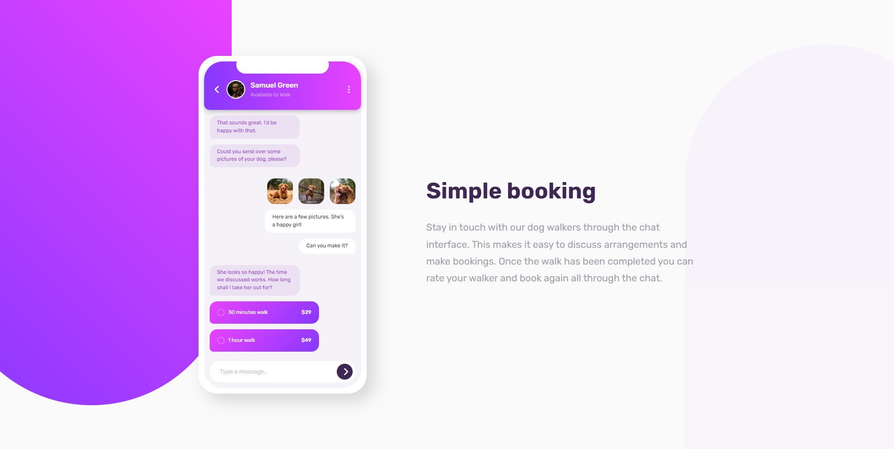
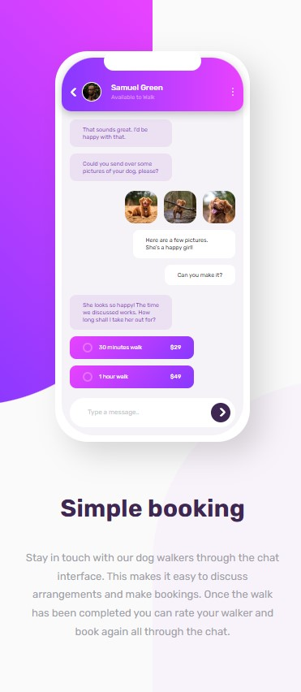

# Chat App CSS Illustration Challenge

This is my submission for the Chat App CSS Illustration challenge from Frontend Mentor. The challenge involved creating a chat application illustration using CSS.

## Challenge Details

- **Challenge:** [Chat App CSS Illustration](https://www.frontendmentor.io/challenges/chat-app-css-illustration-O5auMkFqY)
- **Website:** [Frontend Mentor](https://www.frontendmentor.io)
- **Difficulty:** Intermediate

## Overview

The goal of this challenge was to recreate a chat application illustration provided in the challenge. The illustration included various chat bubbles, user avatars, and a chat input field. The challenge focused on implementing the design using HTML and CSS, without any functionality.

## Technologies Used

- HTML
- CSS

## Features

- Responsive design
- Custom CSS styling

## Screenshots

## Acknowledgements

I would like to thank Frontend Mentor for providing this challenge, as it helped me enhance my CSS skills and improve my understanding of responsive design.
